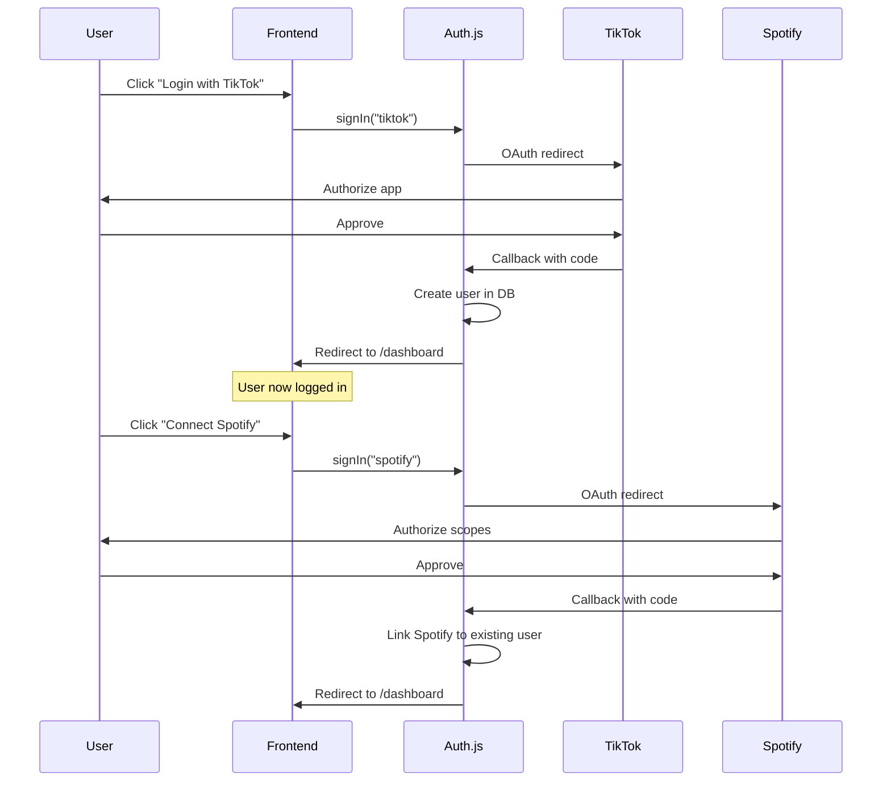

# Authentication Research Notes

> **Last Updated:** 2026-01-30\
> **Status:** Research Complete

This document captures research findings for SongFlow's authentication
implementation.

---

## 1. Overview

SongFlow uses two OAuth integrations:

| Provider    | Purpose                      | Scopes Required                                                                         |
| ----------- | ---------------------------- | --------------------------------------------------------------------------------------- |
| **TikTok**  | Primary login, user identity | `user.info.basic`                                                                       |
| **Spotify** | Music playback control       | `user-read-playback-state`, `user-modify-playback-state`, `user-read-currently-playing` |

---

## 2. Auth.js (NextAuth.js v5)

### 2.1 Why Auth.js?

| Benefit                   | Details                                             |
| ------------------------- | --------------------------------------------------- |
| Built-in TikTok provider  | Handles `client_key` quirk automatically            |
| Built-in Spotify provider | Standard OAuth 2.0 with configurable scopes         |
| DrizzleAdapter            | Auto-creates `users`, `accounts`, `sessions` tables |
| Database sessions         | Secure, httpOnly cookies with CSRF protection       |
| TypeScript support        | Full type safety                                    |

### 2.2 Configuration

```typescript
// src/auth.ts
import NextAuth from "next-auth";
import TikTok from "next-auth/providers/tiktok";
import Spotify from "next-auth/providers/spotify";
import { DrizzleAdapter } from "@auth/drizzle-adapter";
import { db } from "@/lib/db";

export const { handlers, auth, signIn, signOut } = NextAuth({
    adapter: DrizzleAdapter(db),
    providers: [
        TikTok,
        Spotify({
            authorization: {
                params: {
                    scope:
                        "user-read-playback-state user-modify-playback-state user-read-currently-playing",
                },
            },
        }),
    ],
    callbacks: {
        async session({ session, user }) {
            session.user.id = user.id;
            return session;
        },
    },
    session: { strategy: "database" },
    pages: {
        signIn: "/login",
    },
});
```

### 2.3 Environment Variables

```bash
# Auth.js core
AUTH_SECRET=              # Generate with: npx auth secret

# TikTok OAuth
AUTH_TIKTOK_ID=           # From TikTok Developer Portal (Client Key)
AUTH_TIKTOK_SECRET=       # From TikTok Developer Portal

# Spotify OAuth
AUTH_SPOTIFY_ID=          # From Spotify Developer Dashboard
AUTH_SPOTIFY_SECRET=      # From Spotify Developer Dashboard
```

---

## 3. TikTok OAuth Deep Dive

### 3.1 Key Differences from Standard OAuth

| Standard OAuth 2.0          | TikTok OAuth                               |
| --------------------------- | ------------------------------------------ |
| `client_id`                 | `client_key`                               |
| Token endpoint returns JSON | Same                                       |
| Userinfo at `/userinfo`     | `/v2/user/info/` with `fields` query param |
| User data at root           | Nested under `data.user`                   |

### 3.2 TikTok Developer Portal Setup

1. Create app at [developers.tiktok.com](https://developers.tiktok.com)
2. Enable **Login Kit**
3. Add redirect URI: `https://your-domain/api/auth/callback/tiktok`
4. Note: Production apps need TikTok team approval

### 3.3 Scopes Available

| Scope               | Description                   | Required |
| ------------------- | ----------------------------- | -------- |
| `user.info.basic`   | Display name, avatar, open_id | ✅ Yes   |
| `user.info.profile` | Bio, profile deep link        | No       |
| `user.info.stats`   | Follower/following count      | No       |
| `video.list`        | User's public videos          | No       |

### 3.4 Auth.js TikTok Provider (Built-in)

The Auth.js TikTok provider handles all quirks automatically:

```typescript
// What Auth.js does internally (you don't need to write this)
{
  id: "tiktok",
  name: "TikTok",
  type: "oauth",
  authorization: {
    url: "https://www.tiktok.com/v2/auth/authorize/",
    params: {
      client_key: process.env.AUTH_TIKTOK_ID,
      scope: "user.info.basic",
      response_type: "code",
    },
  },
  token: {
    url: "https://open.tiktokapis.com/v2/oauth/token/",
    async request({ params, provider }) {
      // Handles client_key instead of client_id
    },
  },
  userinfo: {
    url: "https://open.tiktokapis.com/v2/user/info/",
    async request({ tokens }) {
      // Adds ?fields=open_id,display_name,avatar_url
      // Extracts from data.user
    },
  },
}
```

### 3.5 Important Notes

> [!WARNING]
> Production TikTok apps require approval from TikTok team. Development/sandbox
> mode works with localhost but has rate limits.

> [!NOTE]\
> TikTok does not provide email addresses via OAuth. User identity is based on
> `open_id` (unique per app).

---

## 4. Spotify OAuth Deep Dive

### 4.1 Developer Portal Setup

1. Create app at
   [developer.spotify.com](https://developer.spotify.com/dashboard)
2. Add redirect URI: `https://your-domain/api/auth/callback/spotify`
3. Request access for required scopes (may require review for production)

### 4.2 Required Scopes for SongFlow

| Scope                         | Purpose                                  |
| ----------------------------- | ---------------------------------------- |
| `user-read-playback-state`    | Get currently playing track, device info |
| `user-modify-playback-state`  | Add to queue, skip track                 |
| `user-read-currently-playing` | Simpler endpoint for current track       |

### 4.3 Token Refresh

Auth.js handles token refresh automatically when using the DrizzleAdapter. The
`accounts` table stores:

- `access_token` — Short-lived (1 hour)
- `refresh_token` — Long-lived
- `expires_at` — Unix timestamp

### 4.4 Getting Valid Tokens in API Routes

```typescript
import { auth } from "@/auth";
import { db } from "@/lib/db";
import { accounts } from "@/lib/db/schema";
import { and, eq } from "drizzle-orm";

export async function getSpotifyToken(userId: string): Promise<string | null> {
    const session = await auth();
    if (!session?.user?.id) return null;

    const [account] = await db
        .select()
        .from(accounts)
        .where(
            and(
                eq(accounts.userId, userId),
                eq(accounts.provider, "spotify"),
            ),
        )
        .limit(1);

    if (!account) return null;

    // Check if token is expired (with 5 min buffer)
    const expiresAt = account.expires_at ? account.expires_at * 1000 : 0;
    if (expiresAt < Date.now() + 300000) {
        // Trigger refresh via Auth.js JWT callback or manual refresh
        // For simplicity, Auth.js v5 auto-refreshes on session access
    }

    return account.access_token;
}
```

---

## 5. Login Flow



---

## 6. Database Schema (Auth.js Compatible)

```typescript
// src/lib/db/schema.ts
import {
    integer,
    primaryKey,
    sqliteTable,
    text,
} from "drizzle-orm/sqlite-core";
import type { AdapterAccountType } from "next-auth/adapters";

export const users = sqliteTable("user", {
    id: text("id").primaryKey().$defaultFn(() => crypto.randomUUID()),
    name: text("name"),
    email: text("email"),
    emailVerified: integer("emailVerified", { mode: "timestamp_ms" }),
    image: text("image"),
});

export const accounts = sqliteTable(
    "account",
    {
        userId: text("userId")
            .notNull()
            .references(() => users.id, { onDelete: "cascade" }),
        type: text("type").$type<AdapterAccountType>().notNull(),
        provider: text("provider").notNull(),
        providerAccountId: text("providerAccountId").notNull(),
        refresh_token: text("refresh_token"),
        access_token: text("access_token"),
        expires_at: integer("expires_at"),
        token_type: text("token_type"),
        scope: text("scope"),
        id_token: text("id_token"),
        session_state: text("session_state"),
    },
    (account) => ({
        compoundKey: primaryKey({
            columns: [account.provider, account.providerAccountId],
        }),
    }),
);

export const sessions = sqliteTable("session", {
    sessionToken: text("sessionToken").primaryKey(),
    userId: text("userId")
        .notNull()
        .references(() => users.id, { onDelete: "cascade" }),
    expires: integer("expires", { mode: "timestamp_ms" }).notNull(),
});
```

---

## 7. TikTok Live Events (Non-OAuth)

> [!IMPORTANT]
> TikTok Live chat listening is **separate from OAuth**. Uses
> `tiktok-live-connector` library via WebSocket.

### 7.1 Library: tiktok-live-connector

```bash
npm install tiktok-live-connector
```

### 7.2 Basic Usage

```typescript
import { WebcastPushConnection } from "tiktok-live-connector";

const connection = new WebcastPushConnection("@username");

connection.on("chat", (msg) => {
    console.log(`${msg.uniqueId}: ${msg.comment}`);
});

connection.on("gift", (data) => {
    console.log(`${data.uniqueId} sent ${data.giftName}`);
});

await connection.connect();
```

### 7.3 Events We Need

| Event       | Purpose                                    |
| ----------- | ------------------------------------------ |
| `chat`      | Parse `!play`, `!revoke`, `!skip` commands |
| `gift`      | VIP queue priority (future)                |
| `streamEnd` | End session automatically                  |

### 7.4 Architecture Note

> [!CAUTION]
> `tiktok-live-connector` uses persistent WebSocket connections. Cannot run in
> serverless functions (Vercel Edge, etc.). Must run as a standalone Node.js
> process or on a persistent server (Railway, Fly.io).

For MVP, run as a separate script triggered when session starts.

---

## 8. References

- [Auth.js Documentation](https://authjs.dev/)
- [Auth.js TikTok Provider](https://authjs.dev/getting-started/providers/tiktok)
- [Auth.js Spotify Provider](https://authjs.dev/getting-started/providers/spotify)
- [TikTok Login Kit](https://developers.tiktok.com/doc/login-kit-web)
- [Spotify Web API](https://developer.spotify.com/documentation/web-api)
- [tiktok-live-connector](https://github.com/zerodytrash/TikTok-Live-Connector)
